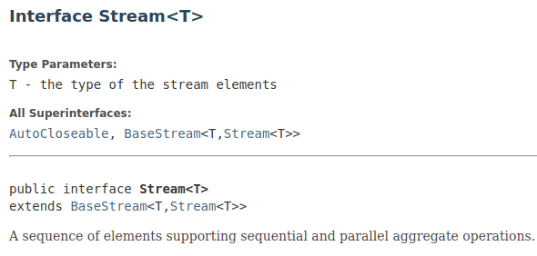
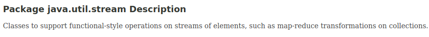

# Java e os Streams

A versão 8 do Java foi lançada oficialmente em Março de 2014 e foi recebida com grande entusiasmo pela comunidade. As maiores novidades de tal versão foram os recursos para programação funcional dentro da linguagem, juntamente com a tão aguardada API de Streams. É sobre esse tema que vou abordar nos próximos parágrafos. O foco maior é em Streams, a programação funcional acaba vindo no mesmo pacote.

Mas o que são Streams? Na wikipedia temos uma boa definição (ao meu ver), que diz o seguinte:

Stream pode ser definido como um fluxo de dados em um sistema computacional. Quando um arquivo é aberto para edição, todo ele ou parte dele fica na memória, permitindo assim alterações, por isto somente quando ele é fechado, tem-se a garantia de que nenhum dado se perderá ou será danificado.

https://pt.wikipedia.org/wiki/Stream

A documentação oficial da interface Stream define que ela representa uma sequência de elementos que suporta operações agregadas sequenciais e paralelas.



Tradução Livre: Uma sequência de elementos que suporta operações agregadas sequenciais e paralelas
Então podemos interagir com esse Stream de dados de várias maneiras, podemos transformar valores, iterar sobre seus elementos, ordenar as informações com base em algum critério (por exemplo através de um Predicate), executar reduções mutáveis e não mutáveis, filtrar elementos também com base em critérios ou funções, enfim, uma infinidade de maneiras diferentes.

O pacote java.util.stream contéma grande parte dos recursos que utilizamos nos exemplos deste artigo, então vamos entrar um pouco mais nos detalhes. Segundo a própria documentação, esta é a descrição do pacote:



Operações e Pipelines
As operações em Stream são dividas em intermediate e terminal, e a combinação entre elas compõem uma Stream Pipeline. Um pipeline consiste em um origem (como uma Collection, um array, etc) e seguido por zero ou mais operações intermediate, tais como Stream.filter ou Stream.map. Como você pode deduzir, o que ficou faltando é a operação terminal, como por exemplo Stream.forEach ou Stream.reduce.

A cada vez que uma operação do tipo intermediate é executada, um novo Stream é retornado. Essas operações são sempre lazy (preguiçosas), executando uma operação intermediate assim como filter(), na verdade não executa nenhum filtro de fato, ao invés disso, é criado um novo Stream, que quando for atravessado conterá todos os elementos do stream inicial que deram match com o Predicate passado para o filter. O processo de consumir, ou atravessar por este stream de origem não começa enquanto a operação terminal da pipeline é executada.

Operações do tipo terminal, como Stream.forEach, IntStream.sum, podem atravessar o stream para produzir um resultado ou um side-effect (efeito colateral). Depois que a operação terminal é executada, a pipeline do stream é considerada consumida, e então não pode mais ser usada. Se você precisar atravessar um stream com a mesma origem novamente, obrigatoriamente vai ser necessário voltar à origem dos dados e criar um novo Stream.

Em quase todos os casos, as operações terminal são eager (ansioso), completando seu percurso da fonte de dados e processando o pipeline antes de retornar. Algumas operações terminais não são lazy, como iterator() e spliterator(), estas foram disponibilizadas para permitir algum tipo de controle por parte do cliente que está consumindo o Stream.

As operações intermediate são divididas em operações stateless (sem estado) e stateful (com estado). As operações stateless, como filter e map, não retêm nenhum estado do elemento visto anteriormente ao processar um novo elemento – cada elemento pode ser processado independentemente das operações em outros elementos. Operações statefiul, assim como distinct e sorted, podem incorporar o estado de elementos vistos anteriormente ao processar novos elementos.

Legal! Então já sabemos o que é (ou temos uma idéia) um Stream, já sabemos qual é o pacote com a maioria dos objetos que precisaremos utilizar. Nesse ponto você já pode estar se perguntando:

Tá…. mas como eu faço para obter o meu próprio Stream para começar a praticar?
Bom, existem algumas maneiras diferentes de se fazer isso, abaixo mostrarei algumas. Ah, e por enquanto ainda não se preocupe com o código, vou entrar no detalhe mais adiante.

 - Através de uma Collection, utilizando os métodos: 
.stream() 
.parallelStream()

```java
Collection<String> stringCollection = Arrays.asList("First", "Second", "Third");
stringCollection.stream()
  .map(String::toUpperCase)
  .forEach(System.out::println);
stringCollection.parallelStream()
  .map(String::toUpperCase)
  .forEach(System.out::println);
```
 - Através de um vetor via Arrays.stream(Object[])

```java
String[] array = {"First", "Second", "Third"};
```

```java
Arrays.stream(array)
        .map(String::toUpperCase)
  .forEach(System.out::println);
```
  
 - A partir de factory methods estáticos na classes de stream, assim como:
```java
Stream.of(Object[])
```
```java
IntStream.of(int…) 
```
```java
IntStream.range(int, int) 
```
```java
Stream.iterate(Object, UnaryOperator)
```

```java
String[] array = {"First", "Second", "Third"};
//Using Array
Stream.of(array)
        .map(String::toUpperCase)
  .forEach(System.out::println);
//Using varargs
Stream.of("One", "Two", "Three")
        .map(String::toUpperCase)
  .forEach(System.out::println);
```
  
```java
//SingleItem or Varags
IntStream.of(1, 3, 2, 5, 4).sorted().forEach(System.out::println);
```

```java
IntStream.range(1, 10).forEach(System.out::println);
```

```java
Stream.iterate(0, n -> n + 1)
  .limit(10)
  .forEach(System.out::println);
```
  
 - As linhas de um arquivo podem ser obtidas em um stream: `BufferedReader.lines()`
 
 - Streams de números randômicos podem ser obtidos: `Random.ints()`

### Exemplos

É agora! Vamos partir para alguns exemplos de como podemos utilizar os Streams com a linguagem Java. Abaixo estão as classes que utilizaremos nos nossos Stream de dados:

```java
public class City {
   private Long id;
   private String name;
   private Integer population;
   //Getters and Setters
 }
 public class State {
   private Long id;
   private String name;
   private Collection<City> cities;
   //Getters and Setters
 }
 ```
Então temos o seguinte método para criar 2 estados, cada um com três cidades cada:

```java
private static Collection<State> initStates() {
   final Collection<City> saoPauloCities = asList(
     new City(1L, "Santo André", 100000),
     new City(2L, "São Bernardo do Campo", 150000),
     new City(3L, "São Caetano do Sul", 80000)
   );
   final Collection<City> rioDeJaneiroCities = asList(
     new City(4L, "Rio de Janeiro", 200000),
     new City(5L, "São Gonçalo", 50000),
     new City(6L, "Parati", 40000)
   );
   final State saoPaulo = new State(1L, "São Paulo", saoPauloCities);
   final State rioDeJaneiro = new State(2L, "Rio de Janeiro", rioDeJaneiroCities);
   return asList(saoPaulo, rioDeJaneiro);
 }
 ```
 
### Map

Dada um estado, gostaríamos de imprimir na tela em ordem alfabética os nomes das cidades que o compõem. Segue um exemplo de solução:

```java
saoPaulo.getCities()
    .stream()         
    .sorted(Comparator.comparing(City::getName))
    .map(City::getName)
    .forEach(System.out::println);
 ```
    
Output: 
```Santo André
São Bernardo do Campo
São Caetano do Sul
```

No exemplo acima, o stream de cities foi iniciado a partir da variável saoPaulo, assim começamos nossa pipeline. A primeira operação que vamos chamar é sorted, que como sabemos préviamente, é do tipo intermediate e stateful. O método sorted espera como parâmetro um Comparator, que nesse caso utilizamos o método estático Comparator.comparing para gerar um comparator a partir do atributo name, que é exposto através de getName.

Em seguida a chamada de map é feita – que sabemos ser uma operação intermediate stateless – então agora estamos no contexto de uma cidade por vez, o método espera como parâmetro uma função que vai ser executada para cada elemento, o resultado é um Stream com os dados depois de aplicada esta função. Neste caso, passamos getName para ser executado. O resultado é um Stream de String, que então possui os nomes das 3 cidades que estão na Collection de cities.

Nossa pipeline já executou duas operações intermediate, ordenamos o Stream pelo nome da cidade e em seguida executamos um mapeamento para o nome da cidade ser retornado. Podemos então executar uma operação do tipo terminal: forEach(), que recebe como parâmetro uma função que será executada para cada um dos elementos do Stream. Utilizamos o método System.out.printLn, porém, mais uma vez utilizamos method reference e passamos assim: System.out::printLn.

### Filter

```java
private static void filter(Collection<State> states) {
    System.out.println("Filtering");
    states.forEach(state -> {
  final List<City> bigCities = state.getCities().stream()
    .filter(city -> city.getPopulation() >= 100000)
    .collect(Collectors.toList());
    System.out.println(state.getName() + " has big cities: " + 
    bigCities.stream()
        .map(City::getName).collect(Collectors.joining(", ")));
    });
}
```

Output: 
```
São Paulo has big cities: Santo André, São Bernardo do Campo
 Rio de Janeiro has big cities: Rio de Janeiro
```
 
Agora estamos iterando os states, dentro de cada estando estamos criando um Stream da coleção de cities e executando um filter. O método filter recebe como parâmetro um Predicate. No exemplo acima usamos uma lambda function que através do elemento city, verifica se o mesmo tem o atributo population com valor maior que 100000. Na sequência é chamado o método collect(Collectors.toList()), que pega todas cidades que atenderam à condição do Predicate e joga em uma lista: List<City> bigCities. Finalmente é executado o print com o nome do state e concatena com a frase ” has big cities: “ e um Stream com as cidades, que é aplicada uma tranformação .map(City::getName) para poder coletar os nomes utilizando o Collectors.joining(“, “) que devolve uma String com os nomes das cidades separadas por vírgula.

Este primeiro artigo fica por aqui, e em breve teremos a continuação com mais exemplos e sugestões de uso para as Streams.

Obrigado pela leitura e atenção. Peço por favor que me enviem feedbacks (positivos e/ou negativos) com relação ao conteúdo apresentado ou algo que queira me dizer.

Referências:

 - https://docs.oracle.com/javase/8/docs/api/java/util/stream/package-summary.html
 - https://en.wikipedia.org/wiki/Java_version_history
 - https://docs.oracle.com/javase/8/docs/api/java/util/stream/Stream.html
 - https://docs.oracle.com/javase/8/docs/api/java/util/function/Predicate.html
 - https://docs.oracle.com/javase/8/docs/api/java/util/stream/Collector.html
